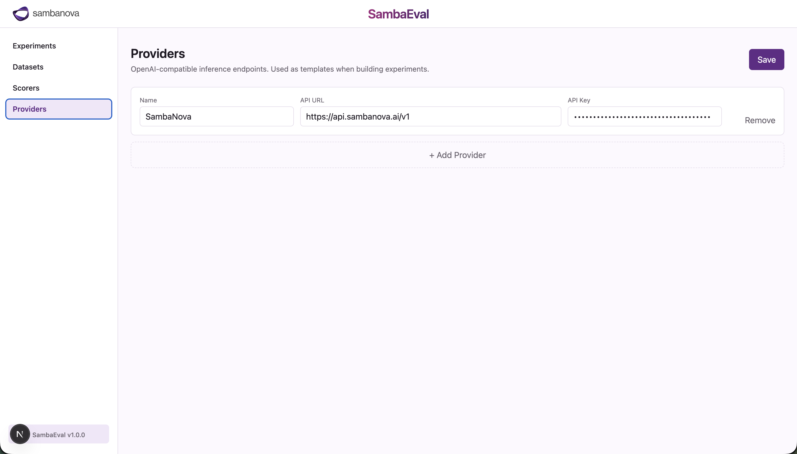
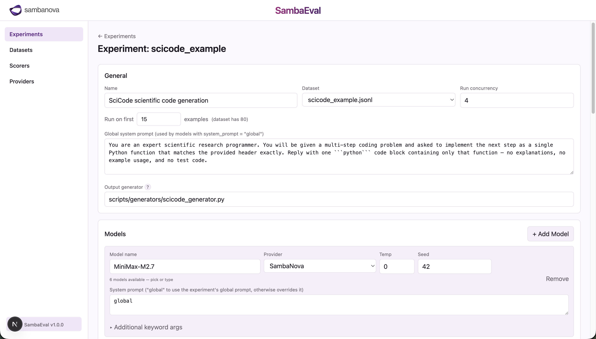
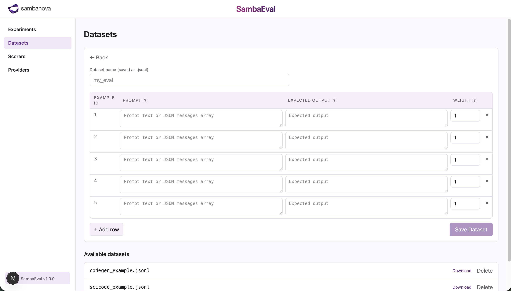
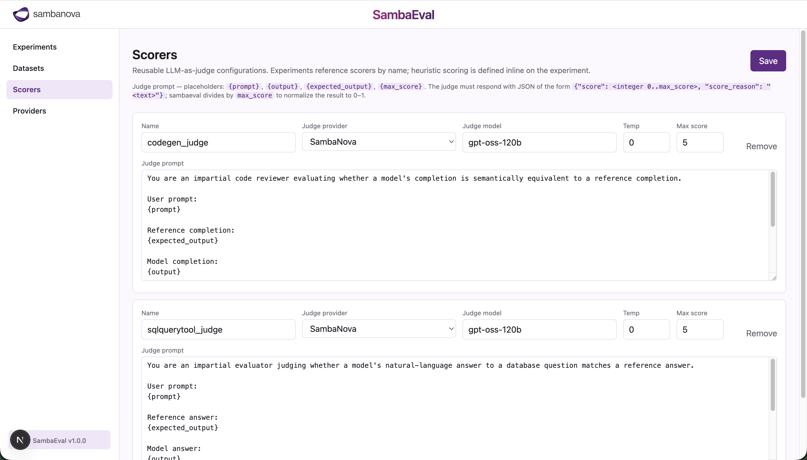
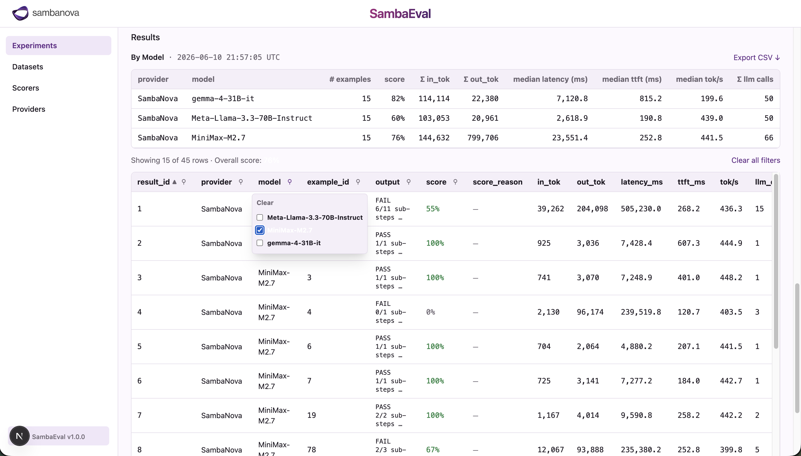

<a href="https://sambanova.ai/">
<picture>
  <source media="(prefers-color-scheme: dark)" srcset="../images/light-logo.png" height="100">
  
</picture>
</a>

# SambaEval

Local LLM evaluation workbench. Configure providers, build experiments with one or more models, score them against a dataset, and explore the results — including token usage, TTFT, and tokens-per-second per row.

**SambaEval is driven from the command line.** Run evals headlessly with `sambaeval run experiment.json` — or import the Python library — with no browser and no Node involved. A web UI is available for interactive editing and result browsing, but it is **entirely optional**; the CLI and UI operate on the same files under `data/`.

## Contents

- [Stack](#stack)
- [Quick start](#quick-start)
  - [CLI (no UI)](#cli-no-ui)
  - [Optional: the web UI](#optional-the-web-ui)
- [Command-line interface](#command-line-interface)
- [File layout](#file-layout)
  - [Example experiments at a glance](#example-experiments-at-a-glance)
- [The web UI (optional)](#the-web-ui-optional)
- [Configuring providers](#configuring-providers)
- [Experiment schema](#experiment-schema)
- [Dataset schema](#dataset-schema)
- [Scoring](#scoring)
  - [Scorers](#scorers)
- [Running an experiment](#running-an-experiment)
- [Results](#results)
- [Custom output generators](#custom-output-generators)
- [SciCode example](#scicode-example-executing-model-code)
  - [One-time setup: the numeric reference data](#one-time-setup-the-numeric-reference-data)
  - [Regenerating / resizing the dataset](#regenerating--resizing-the-dataset)
  - [Running model code safely](#running-model-code-safely)
- [Testing](#testing)

## Stack

The evaluation engine is a **Python package** (`sambaeval`) — dataset loading, the concurrent run engine, scoring, and output generation (model calls, tool-use loops, sandboxed code execution). You use it directly as a **CLI** or **library**, or run it as an **HTTP API** that the optional web UI talks to. State — provider configs, experiments, datasets, results — is plain files under `data/`; there is no database.

- **Engine / CLI / library / API:** Python 3.11+ — the `sambaeval` package (`sambaeval run` CLI; `sambaeval-server` FastAPI app). See [backend/README.md](backend/README.md).
- **Web UI (optional):** Next.js 16 (App Router) + React 19 + TypeScript + Tailwind CSS v4 — talks to the API over HTTP (`NEXT_PUBLIC_API_BASE_URL`, default `http://localhost:8000`).
- Local file storage under `data/`.

## Quick start

You only need Python to run evals — the web UI is optional.

### CLI (no UI)

One-time setup from the project root:

```bash
python -m venv .venv
.venv/bin/python -m pip install -e backend
cp data/providers.json.example data/providers.json
```

Open `data/providers.json` and set a real `api_key`, then run any experiment:

```bash
.venv/bin/sambaeval run data/experiments/codegen_example.json --concurrency 4
```

That runs an example end-to-end and writes results under `data/results/`. (`.venv/bin/sambaeval` calls the CLI without activating the venv; or run `source .venv/bin/activate` once, after which plain `sambaeval …` works.) See [Command-line interface](#command-line-interface) for full usage.

### Optional: the web UI

For interactive editing and result browsing, run the backend API and the frontend as two processes, in two terminals.

Terminal 1 — backend API (serves <http://localhost:8000>):

```bash
.venv/bin/python -m pip install -e 'backend[server]'
.venv/bin/sambaeval-server
```

Terminal 2 — frontend (serves <http://localhost:3001>):

```bash
npm install
npm run dev
```

Open <http://localhost:3001>. (SambaEval defaults to 3001 so it can run side-by-side with SambaWiz on 3000.) The UI talks to the backend at `http://localhost:8000`; set `NEXT_PUBLIC_API_BASE_URL` to point elsewhere. On first load, the Providers page auto-creates `data/providers.json` with a placeholder SambaNova entry you then edit.

## Command-line interface

The CLI runs experiments headlessly — no web server, no Node. It's the primary way to use SambaEval in scripts and CI.

```bash
.venv/bin/sambaeval run <experiment.json> [--concurrency N] [--resume]
```

- `<experiment.json>` — path to an experiment file, anywhere on disk.
- `--concurrency N` — max concurrent tasks (1–32); defaults to the experiment's `concurrency`, or 4.
- `--resume` — resume the latest unfinished run for this experiment instead of starting fresh.

It writes results to `data/results/<id>/<run_id>/` (the same place the UI reads from), prints per-model average scores, and exits non-zero if any row errored.

- **`providers.json` is required.** Unlike the UI, the CLI does not auto-create it — copy `data/providers.json.example` to `data/providers.json` and add your key.
- **Experiment files can be self-contained.** The `dataset` and the LLM-judge definition can be inlined directly in the experiment JSON, so a single file is fully portable — no separate dataset/scorer files needed.

SambaEval is also an importable library: `from sambaeval import run_experiment`. See [backend/README.md](backend/README.md) for the complete CLI reference, the self-contained experiment schema, and the library API.

## File layout

All evaluation state — provider configs, experiment definitions, datasets, and results — is stored as plain files under `data/` so they're easy to inspect, diff, and version-control. The app reads and writes these files directly; there is no database.

```
data/
├── providers.json                       # autogenerated; gitignored — holds API keys
├── experiments/
│   └── <id>.json                        # experiment definitions
├── scorers/
│   └── <name>.json                      # reusable LLM-as-judge configs
├── datasets/
│   ├── *.csv / *.jsonl                  # eval datasets
│   ├── chinook.db                       # SQLite fixture used by the SQL example
│   └── scicode/                         # SciCode fixture (+ your gitignored test_data.h5)
└── results/
    └── <id>/
        └── <run_id>/                    # one directory per run
            ├── results.csv              # per-row outputs, scores, and metrics
            ├── run.json                 # run status + counts
            └── experiment.json          # snapshot of the experiment at run time
```

The example experiments (`codegen_example`, `sqlquerytool_example`, `scicode_example`), their datasets, the scorers they reference (`codegen_judge`, `sqlquerytool_judge`), and one set of result CSVs are committed so the repo is runnable out of the box. `providers.json` and `test_data.h5` are gitignored — the former is autogenerated and holds secrets, the latter is the large SciCode reference file you download yourself (see [SciCode example](#scicode-example-executing-model-code) below).

### Example experiments at a glance

| Experiment | Dataset File | Scorer Type | LLM Workflow | Expected Runtime |
| ---------- | ------------ | ----------- | ------------ | ---------------- |
| `codegen_example` | `codegen_example.jsonl` | LLM-as-judge | Code generation | ~8 sec with run concurrency of 4 |
| `sqlquerytool_example` | `sqlquerytool_example.jsonl` | LLM-as-judge | SQL generation & query execution | ~12 sec with run concurrency of 4 |
| `scicode_example` | `scicode_dev.jsonl` | Heuristic | Code generation & execution in sandbox | ~24 min for the 15 dev examples with run concurrency of 4 |

## The web UI (optional)

The web UI is a convenience layer over the same `data/` files and backend the CLI uses — handy for interactive editing and browsing results, but never required. The concept sections that follow (providers, experiments, datasets, scoring) apply whether you drive runs from the CLI or the UI; in the UI, each maps to a page. In the left-hand nav the pages are ordered by **expected frequency of use** — **Experiments**, then **Datasets** and **Scorers**, with **Providers** last — while the sections below are ordered setup-first, so each concept is introduced before the ones that depend on it.

## Configuring providers



A provider is a reusable definition of an OpenAI-compatible inference endpoint — a name, an `api_url`, and an `api_key` — that experiments reference by name for both their models and their LLM judge. They live in `data/providers.json`, which the app autogenerates on first read with a placeholder SambaNova entry that you then replace with your real key.

```jsonc
[
  {
    "name": "SambaNova",
    "api_url": "https://api.sambanova.ai/v1",
    "api_key": "Obtain from https://cloud.sambanova.ai/apis"
  }
]
```

Replace `api_key` with a real key (or add more providers) via the Providers page in the UI; saves write back to the same file. Providers must speak the OpenAI-compatible `/chat/completions` API — works with OpenAI, SambaNova Cloud, vLLM, Ollama (via its OpenAI shim), and most modern inference gateways.

## Experiment schema



An experiment is a JSON document that specifies one or more models, a dataset, a system prompt, and a scoring strategy — everything needed to reproduce a single evaluation run. Each experiment lives at `data/experiments/<id>.json` and can be created from the Experiments page in the UI or hand-edited.

```jsonc
{
  "id": "codegen_example",
  "name": "Code completion example",
  "system_prompt": "You are a careful code assistant. Reply with only the requested fragment.",
  "dataset": "codegen_example.csv",
  "models": [
    {
      "name": "Meta-Llama-3.3-70B-Instruct",
      "provider_name": "SambaNova",
      "temperature": 0,
      "seed": 42,
      "system_prompt": "global",
      "additional_kwargs": { "top_p": 0.9, "max_tokens": 1024 }
    }
  ],
  "scorer": {
    "type": "llm",
    "scorer_name": "codegen_judge"
  },
  "output_generator": ""
}
```

- `models[].provider_name` must match a `name` in `providers.json`.
- `models[].system_prompt`: `"global"` to use the experiment-level `system_prompt`, or explicit text that overrides for that one model.
- `models[].seed` is optional. Sent as the `seed` field on the chat completions request when set; omit (or leave the field blank in the UI) for non-deterministic sampling.
- `models[].additional_kwargs` is optional. Each entry is forwarded as-is to the provider's `/chat/completions` body (e.g. `top_p`, `top_k`, `max_tokens`, `stop`). In the UI editor, values are parsed as JSON, so wrap string values in double quotes (`"<|im_end|>"`); bare `42` becomes a number, `true` becomes a boolean, etc.
- `scorer` is optional and defaults to the heuristic scorer when omitted — `{ "type": "heuristic" }` or `{ "type": "llm", "scorer_name": "<name>" }`. See [Scoring](#scoring) for the two types.
- `output_generator` is optional. Blank/missing → the default generator script (`scripts/generators/default_generator.py`). See [Custom output generators](#custom-output-generators) below.

## Dataset schema



A dataset is a CSV file of test prompts and the expected outputs they should produce. Datasets live at `data/datasets/*.csv`, can be shared across multiple experiments, and use the header `example_id,prompt,expected_output,weight`. The `weight` column is optional — omit it (or leave the cell empty) and rows default to `1.0`.

> **How the UI lists datasets:** the picker does a **non-recursive** `readdir` of `data/datasets/`, keeping only `.csv`/`.jsonl` entries — each is expected to parse against the schema above. So non-dataset fixtures are kept out of the listing by either extension (`chinook.db`) or location (the SciCode `scicode_problems.jsonl` fixture lives in the `scicode/` subfolder), which is why those live where they do.

| Column   | Type   | Notes                                                                                                                  |
| -------- | ------ | ---------------------------------------------------------------------------------------------------------------------- |
| example_id | int  | Unique row id within the dataset.                                                                                      |
| prompt   | string | User prompt sent to the model. Can span multiple lines if the field is properly CSV-quoted.                            |
| expected_output | string | Expected output. The **heuristic scorer** treats `contains:NEEDLE` as a substring match; otherwise it's exact-match. |
| weight   | float  | **Optional**, defaults to `1.0`. Score multiplier — heuristic returns `weight` on a hit; the LLM judge multiplies its normalized score by `weight`. Use it to (a) stress the relative importance of examples in the final score (e.g. weight a critical regression case at `5.0` and trivia at `0.5`), and (b) combine multiple `contains:` checks for a single logical example by splitting it across several rows with partial weights — e.g. two rows with weight `0.5` each, one asserting `contains:Paris` and one asserting `contains:France`, sum to a max of `1.0` only when both substrings appear. |

## Scoring

Each row of model output is graded against the dataset's expected output to produce the row's final `score`. The scorer is configured per experiment via the `scorer` field and comes in two flavors:

- **Heuristic** (`{"type":"heuristic"}`): exact-match by default, `contains:NEEDLE` prefix for substring match. Returns `weight` on a hit, `0` otherwise. Defined inline on the experiment — there is no separate file.
- **LLM judge** (`{"type":"llm","scorer_name":"<name>"}`): references a reusable scorer definition at `data/scorers/<name>.json`. See [Scorers](#scorers) below.

### Scorers



LLM-as-judge configurations live in their own module so they can be reused across experiments. Each scorer is a JSON file at `data/scorers/<name>.json`:

```jsonc
{
  "name": "codegen_judge",
  "provider_name": "SambaNova",
  "model": "gpt-oss-120b",
  "temperature": 0,
  "judge_prompt": "...{prompt}...{expected_output}...{output}...{max_score}...",
  "max_score": 5
}
```

At run time, sambaeval looks up the scorer by name, renders `judge_prompt` with `{prompt}`, `{expected_output}`, `{output}`, and `{max_score}` placeholders, calls the configured judge model with `response_format: json_object`, expects `{"score": <int>, "score_reason": "<text>"}`, normalizes the integer to `[0, 1]` and multiplies by `weight`. A default judge prompt is defined as `DEFAULT_JUDGE_PROMPT` in the backend ([backend/sambaeval/scoring.py](backend/sambaeval/scoring.py)); the UI keeps an in-sync copy in [app/lib/types.ts](app/lib/types.ts) to prefill the editor.

Manage scorers from the **Scorers** page in the UI, or hand-edit the JSON files directly.

## Running an experiment

However you start a run — `sambaeval run` on the command line (see [Command-line interface](#command-line-interface)) or the **Run** button in the UI — the backend executes the chosen output generator for every `(model, dataset row)` pair, scores each output, and writes the combined results to disk.

It runs `models × dataset_rows` as tasks with a bounded thread pool (default 4, set via `--concurrency` or the Run page). Each task calls the output generator **in-process**, captures `output` + `metrics`, then scores against `dataset.expected_output`. Results are written incrementally to `data/results/<id>/<run_id>/results.csv` (alongside `run.json` and an `experiment.json` snapshot); when driven over the HTTP API, progress also streams back as Server-Sent Events.

## Results



Experiment results are generated by the backend and contain evaluation scores for each test in the given dataset across all models in the experiment, alongside per-row token usage and latency metrics. They are stored at `data/results/<id>/<run_id>/results.csv` and surfaced in the UI as a sortable, filterable table.

| Column          | Meaning                                                                  |
| --------------- | ------------------------------------------------------------------------ |
| result_id       | Row id within the result file.                                           |
| provider, model | The provider/model that produced this row's output.                      |
| example_id      | Dataset row id (joins back to `dataset.example_id`).                     |
| output          | Final text emitted by the output generator (after any tool-use loop).    |
| score           | Final score (weight-multiplied for both scorers).                        |
| score_reason    | Judge's stated reasoning (LLM scorer only).                              |
| input_tokens    | Sum of prompt tokens across all LLM calls for this row.                  |
| output_tokens   | Sum of completion tokens across all LLM calls for this row.              |
| latency_ms      | Sum of per-call latency across all LLM calls for this row.               |
| ttft_ms         | Median time-to-first-token across all LLM calls for this row.            |
| tps             | Median completion tokens/sec across all LLM calls for this row.          |
| num_llm_calls   | Number of LLM calls the generator made for this row (1 for default, >1 for tool-use loops). |

Server-reported timings (`time_to_first_token`, `total_latency`, `completion_tokens_after_first_per_sec`) are preferred; the generator falls back to client-side measurements derived from the streaming chunks when the provider doesn't expose them.

The results table in the UI is sortable on every column and filterable by unique values per column.

## Custom output generators

An output generator is the Python class that turns a `(system_prompt, messages)` pair into the row's final `output` string. The default generator does a single streaming chat completion; custom generators can implement tool use, multi-turn conversations, retrieval, or any other orchestration before producing the final answer. All generators live in [scripts/generators/](scripts/generators/) and are referenced by path from an experiment's `output_generator` field.

To customize behavior — tool use, SQL execution, multi-turn flows, agentic loops — write a new script that subclasses the base `OutputGenerator` and point your experiment's `output_generator` field at it.

**Base class:** [scripts/generators/base.py](scripts/generators/base.py) defines `OutputGenerator` with:

- `__init__(provider, model)` — stores the provider and model dicts.
- `stream_completion(messages, **kwargs) -> str` — one streaming OpenAI-compatible chat completion. Records token usage and timing automatically. Subclasses can override this if they need to capture more than text from the stream (e.g. tool calls).
- `_record_call(usage_dict, t_start, t_first, t_end)` — helper for subclasses that override `stream_completion`; appends one row to the per-call metrics list so aggregation stays consistent.
- `generate_output(system_prompt, messages) -> str` — the method **most subclasses override**. Default does a single `stream_completion`.
- `aggregate_metrics() -> dict | None` — sums tokens/latency and takes medians of TTFT/TPS across all `_record_call` entries.

**Custom script skeleton:**

```python
# scripts/generators/my_custom.py
from base import OutputGenerator, run_cli

class MyGenerator(OutputGenerator):
    def generate_output(self, system_prompt: str, messages: list[dict]) -> str:
        # Call self.stream_completion() one or more times, do whatever
        # orchestration you need, return the final text.
        ...

# Optional: lets you run the script standalone for quick testing. The backend
# does NOT use this path — it imports the class and calls it in-process.
if __name__ == "__main__":
    run_cli(MyGenerator)
```

Then set `"output_generator": "scripts/generators/my_custom.py"` on your experiment.

**Worked example — SQL tool use:** [scripts/generators/sql_query_execution.py](scripts/generators/sql_query_execution.py) shows how to drive a tool-use loop. It:

1. Overrides `stream_completion` to also accumulate streamed `delta.tool_calls` and returns `(text, tool_calls)`. The override calls `self._record_call(...)` so metrics still aggregate correctly.
2. Overrides `generate_output` to loop: call the model with an `execute_sql_query` tool, run any returned SQL against `data/datasets/chinook.db`, append the result as a `role=tool` message, repeat until the model produces a final answer (or the turn cap is hit).

The matching experiment [data/experiments/sqlquerytool_example.json](data/experiments/sqlquerytool_example.json) embeds the Chinook schema in its system prompt and uses an LLM judge to score the natural-language answers.

**How generators run:** the backend loads your script **in-process** — it imports the module, picks the generator class your script designates via `run_cli(<Class>)` (so a script can define helper subclasses alongside the real one; with no `run_cli` it falls back to the sole `OutputGenerator` subclass, or the base class for the default script), instantiates it once per `(model, dataset row)`, calls `generate_output(...)`, and reads `aggregate_metrics()`. There is no subprocess and no stdin/stdout protocol. Provider lookup and the `system_prompt: "global"` precedence are handled by the backend before `generate_output` is called, so a custom generator usually only overrides `generate_output`. The dataset row's `example_id` is exposed as `self.example_id`, which custom generators can use to look up per-row fixtures (the SciCode example below relies on this).

## SciCode example (executing model code)

[SciCode](https://scicode-bench.github.io/) is a benchmark of real scientific-coding problems, each decomposed into ordered sub-steps. Unlike the other examples, correctness is decided by **executing** the generated code against numeric reference outputs — so this example ships a custom generator that generates each sub-step, runs its test cases, and reports `PASS`/`FAIL`. The pieces:

- [scripts/convert_scicode.py](scripts/convert_scicode.py) — converts the upstream SciCode problems into a self-contained fixture ([data/datasets/scicode/scicode_problems.jsonl](data/datasets/scicode/scicode_problems.jsonl), all 80 problems) and two SambaEval datasets split by SciCode's official dev/test sets: [data/datasets/scicode_dev.jsonl](data/datasets/scicode_dev.jsonl) (15 problems) and [data/datasets/scicode_test.jsonl](data/datasets/scicode_test.jsonl) (65 problems).
- [scripts/generators/scicode_generator.py](scripts/generators/scicode_generator.py) — the custom generator. Looks up the problem by `self.example_id`, generates each sub-step sequentially (feeding prior generated code forward), executes each step's tests against `test_data.h5`, and emits a `{passed}/{total} sub-steps passed` summary (prefixed `PASS` only when every sub-step passes, otherwise `FAIL`).
- [scripts/generators/scicode_test_utils.py](scripts/generators/scicode_test_utils.py) — h5 reader and value-comparison helpers vendored from SciCode.
- [data/experiments/scicode_example.json](data/experiments/scicode_example.json) — wires the dataset to the generator with a heuristic `ratio:` scorer.

Because the generator runs the tests and emits the verdict, `expected_output` is `ratio:` and **no LLM judge is involved** — the heuristic scorer reads the `{passed}/{total}` fraction from the generator's output and awards that fraction of the row's weight. A problem where 2 of 10 sub-steps pass therefore scores 0.2 rather than 0.

For how the fixture is built, where to download the source files, and SciCode's with-/no-background setting (`SCICODE_WITH_BACKGROUND`), see [data/datasets/scicode/README.md](data/datasets/scicode/README.md).

### One-time setup: the numeric reference data

The reference outputs live in `test_data.h5` (~1 GB), which is **not committed** (it's too large and is gitignored as `*.h5`):

1. Download `test_data.h5` from the SciCode numeric test data:
   <https://drive.google.com/drive/folders/1W5GZW6_bdiDAiipuFMqdUhvUaHIj6-pR>
2. Save it anywhere on your machine (e.g. `~/scicode/test_data.h5`).
3. Open [scripts/generators/scicode_generator.py](scripts/generators/scicode_generator.py) and set the module-level global to that path:
   ```python
   test_data_h5_path = "/absolute/path/to/test_data.h5"
   ```

Until that path points at a real file, every SciCode row scores `FAIL` with a message telling you to set it.

### Regenerating / resizing the dataset

The committed dataset covers all 80 problems. To regenerate it or cut it to a cheaper subset, see [data/datasets/scicode/README.md](data/datasets/scicode/README.md).

### Running model code safely

> **The SciCode generator executes model-generated Python.** By default it runs each sub-step inside an **ephemeral, network-less Podman container** (via [llm-sandbox](https://github.com/vndee/llm-sandbox)) — a fresh container per execution, destroyed immediately after. Because sub-steps run sequentially within a row, the number of *concurrent* containers is bounded by the executor's worker pool (default 4), not by the number of rows.

This path has **no Docker dependency** — it uses Podman, and mounts are passed as plain OCI dicts. (The `docker` Python package is pulled in transitively by `llm-sandbox`, but it's just a client library; no Docker daemon, Desktop, or `~/.docker/config.json` is required.)

> **Run Podman rootless.** The container is the only real isolation boundary, and its hardening assumes rootless Podman — container-root is then mapped to an unprivileged host UID via a user namespace. Please don't run Podman as root (or via `sudo podman`), as that weakens every guard below. You can confirm rootless mode with `podman info --format '{{.Host.Security.Rootless}}'`, which should print `true`.

**One-time image build** (bakes in the scientific stack so the container needs no network at run time):

```bash
podman build -t scicode-sandbox -f scripts/generators/scicode_sandbox.Dockerfile .
```

If that build fails pulling the base image with a credential-helper error, it's because Podman falls back to `~/.docker/config.json` and a `credsStore`/`credHelpers` entry there errors. Build with an empty auth file so Podman does an anonymous pull and never touches the Docker config:

```bash
printf '{"auths":{}}' > /tmp/empty-auth.json
podman build --authfile /tmp/empty-auth.json -t scicode-sandbox -f scripts/generators/scicode_sandbox.Dockerfile .
```

**Backend selection** via the `SCICODE_SANDBOX` env var:

| `SCICODE_SANDBOX` | Behaviour |
| ----------------- | --------- |
| `podman` (default) | Ephemeral Podman container per execution. `test_data.h5` is bind-mounted read-only; `network_mode=none`; all capabilities dropped (`cap_drop=ALL`); memory/pids/CPU and open-file (`ulimits`) caps; execution force-killed after `STEP_TIMEOUT_SECONDS`. Assumes **rootless** Podman, so container-root maps to an unprivileged host UID. (A read-only rootfs, non-root in-container user, and `no-new-privileges` are *not* applied — this podman-py/crun stack can't express them without breaking execution; see the comment in `_run_in_sandbox`.) |
| `subprocess`      | **Unsandboxed** local execution — dev/CI only, **not a security boundary**. |

Other env vars: `SCICODE_SANDBOX_IMAGE` (image name, default `scicode-sandbox`), `SCICODE_SANDBOX_MEM` (memory limit, default `4g`), and `SCICODE_WITH_BACKGROUND` (include SciCode's per-step scientist background in the prompt when the fixture has it, default on; `0` forces the no-background setting).

Two guards apply on **every** backend as defense-in-depth — **not** a boundary on their own:

- **Static screening** — generated code is parsed (AST) and rejected if it imports modules outside the problem's declared dependencies, or uses dangerous builtins (`open`, `exec`, `eval`, `__import__`, …) or sandbox-escape attribute tricks. Python is dynamic, so this is bypassable; treat it as a quality signal.
- **(subprocess backend only)** the process is launched with a **scrubbed environment** (API keys stripped) and **POSIX resource limits** (`setrlimit` on CPU/file-size/processes; the memory cap is **not enforced on macOS**).

**Why a container per execution** rather than one shared long-lived container or a per-row container: the generator both calls the LLM (needs network + your API key) *and* runs untrusted code (must have neither), so only the execution step is containerized — the generator itself stays on the host. A fresh container per execution gives full isolation with no cross-run state to reset, and self-bounds concurrency to the worker pool. If container churn ever dominates runtime, llm-sandbox also supports a **pooled** mode (`create_pool_manager` / `PoolConfig`) that keeps a warm pool of N containers — a drop-in optimization.

**Other sandbox options** (if you don't want Podman/llm-sandbox): Docker directly with `--network none` + `--memory`/`--cpus` + `--read-only` + a non-root user; or, Linux-native and lighter, **bubblewrap** (unprivileged user namespaces; pair with cgroups for limits), **nsjail** (namespaces + seccomp + cgroups in one), or **gVisor** (`runsc`, a user-space kernel intercepting syscalls — the strongest boundary, usable as a Docker runtime). **firejail** is the easiest CLI but is SUID-root, which adds its own attack surface.

## Testing

The quickest end-to-end smoke test is to run an example experiment through the CLI against a real provider (this costs real tokens, so it's manual, not CI):

```bash
.venv/bin/sambaeval run data/experiments/codegen_example.json --concurrency 4
```

It exercises the full path — dataset loading, the concurrent run engine, in-process output generation, scoring, and results writing — and prints per-model average scores. A populated `data/providers.json` is required.
