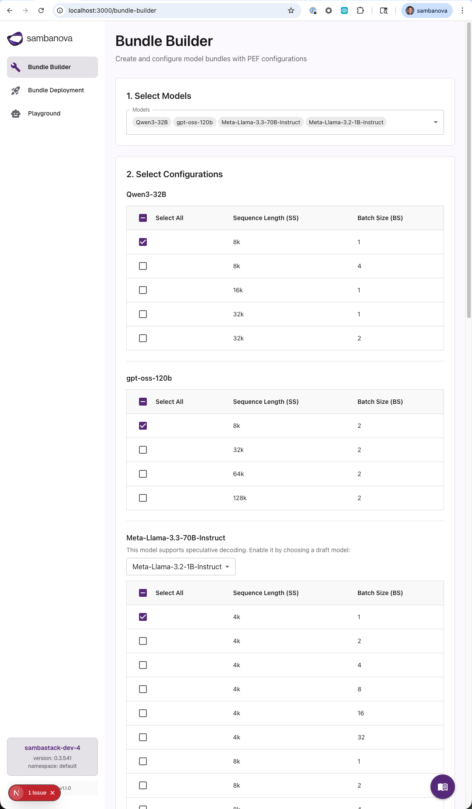
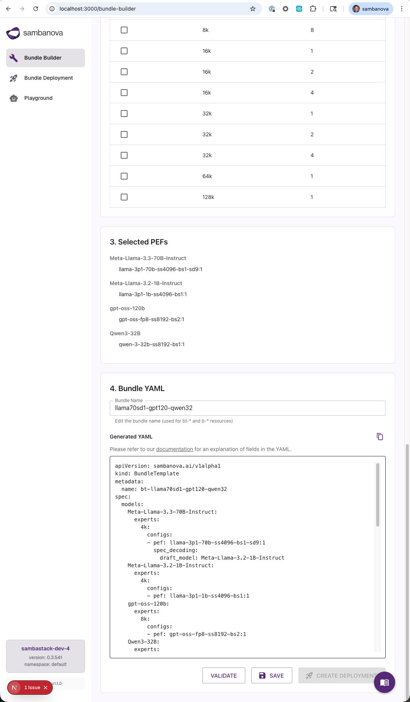
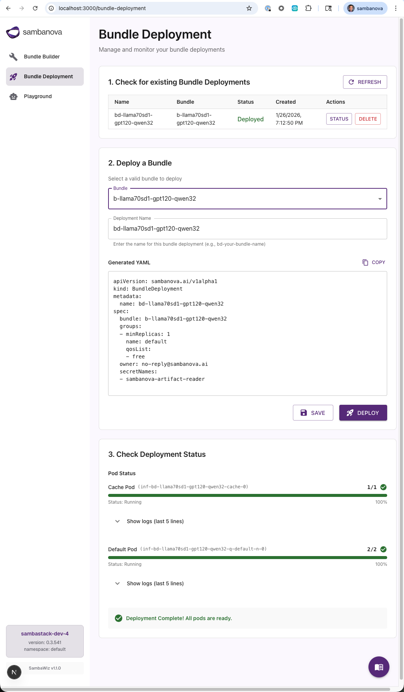
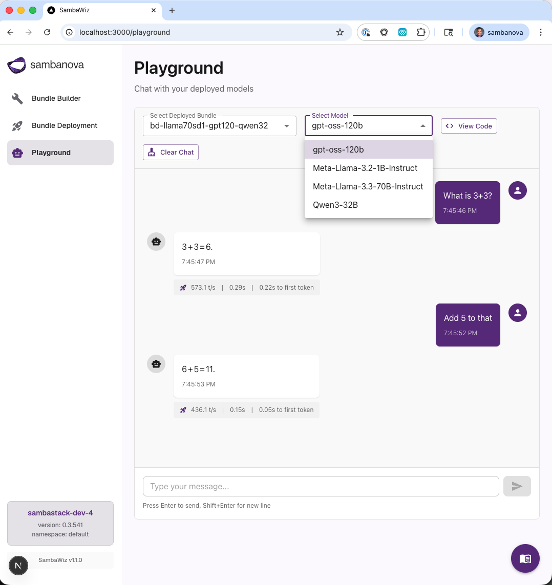

<a href="https://sambanova.ai/">
<picture>
  <source media="(prefers-color-scheme: dark)" srcset="../images/light-logo.png" height="100">
  
</picture>
</a>

# SambaWiz

SambaWiz is a GUI wizard that accelerates the creation and deployment of model bundles on [SambaStack](https://docs.sambanova.ai/docs/en/admin/overview/sambastack-overview).

## Contents

- [Overview](#overview)
- [Prerequisites](#prerequisites)
- [Getting Started](#getting-started)
  - [1. Install Dependencies](#1-install-dependencies)
  - [2. Configure Application Settings](#2-configure-application-settings)
  - [3. Configure Kubernetes Access](#3-configure-kubernetes-access)
  - [4. Verify Configuration Files](#4-verify-configuration-files)
  - [5. Run Development Server](#5-run-development-server)
  - [6. Build for Production](#6-build-for-production)
- [Features](#features)
  - [1. Home](#1-home)
  - [2. Bundle Builder](#2-bundle-builder)
  - [3. Bundle Deployment](#3-bundle-deployment)
  - [4. Playground](#4-playground)
- [Project Structure](#project-structure)
- [API Endpoints](#api-endpoints)
  - [GET /api/kubeconfig-validate](#get-apikubeconfig-validate)
  - [POST /api/validate](#post-apivalidate)
- [Technology Stack](#technology-stack)
- [Development](#development)
- [Security Considerations](#security-considerations)
- [Troubleshooting](#troubleshooting)
  - [Configuration Issues](#configuration-issues)
  - [Version Compatibility Issues](#version-compatibility-issues)
  - [Connection Issues](#connection-issues)
  - [Common Error Messages](#common-error-messages)

## Overview

SambaWiz provides an intuitive interface to:
- Select AI models from an available catalog
- Configure PEF (Processor Executable Format) settings including sequence size (SS) and batch size (BS)
- Map models to checkpoints
- Generate valid Kubernetes YAML manifests (BundleTemplate and Bundle resources)
- Validate and apply bundles to a Kubernetes cluster
- View bundle validation status and error messages

## Prerequisites

- Access to a Kubernetes cluster with SambaStack [installed](https://docs.sambanova.ai/docs/en/admin/installation/prerequisites) and SambaNova CRDs available (minimum helm version specified in the VERSION file)
- Valid `kubeconfig.yaml` for your SambaStack environment
- Node.js 18+ and npm
- `kubectl` and `helm` CLI tools installed and configured (must be in your PATH as the application uses these commands via Node.js)

## Getting Started

### 1. Install Dependencies

```bash
npm install
```

### 2. Configure Application Settings

Create an `app-config.json` file in the project root directory by copying the example:

```bash
# Copy the example config file
cp app-config.example.json app-config.json
```

Edit `app-config.json` with your settings:

```json
{
  "checkpointsDir": "gs://your-bucket-name/path/to/checkpoints/",
  "currentKubeconfig": "your-environment-name",
  "kubeconfigs": {
    "your-environment-name": {
      "file": "kubeconfigs/your-environment.yaml",
      "namespace": "default",
      "uiDomain": "https://ui-your-environment.example.com/",
      "apiDomain": "https://api-your-environment.example.com/",
      "apiKey": "your-api-key-here"
    }
  }
}
```

**Important**:
- `app-config.json` is gitignored for security
- `checkpointsDir`: GCS checkpoint directory path relative to which the checkpoints `app/data/checkpoint_mapping.json` can be found
- `currentKubeconfig`: Name of the currently selected environment
- `kubeconfigs`: Object containing all configured environments
  - Each environment has:
    - `file`: Path to kubeconfig file relative to sambawiz folder
    - `namespace`: Kubernetes namespace for this environment
    - `uiDomain`: Optional UI domain URL for the environment (used to create an API key)
    - `apiDomain`: API domain URL for the environment (required for Playground chat functionality)
    - `apiKey`: API key for environment-specific authentication (required for Playground chat functionality)
- The checkpoints directory is used to construct full checkpoint paths
- Configuration can be updated through the home page UI
- You can configure multiple environments in the `kubeconfigs` object

### 3. Configure Kubernetes Access

Place your kubeconfig files in the `kubeconfigs/` directory:

```bash
# Copy your kubeconfig to the kubeconfigs directory
cp /path/to/your/kubeconfig.yaml ./kubeconfigs/your-environment.yaml
```

Then add the environment to the `kubeconfigs` object in `app-config.json` with the corresponding file path, namespace, and optional API key.

**Important**:
- All files in the `kubeconfigs/` directory are gitignored for security (except `kubeconfig_example.yaml`)
- The application reads the kubeconfig file path from `app-config.json`
- The kubeconfig is validated on app startup using `helm list` to verify cluster connectivity
- If validation fails, an error alert is displayed with instructions to check your kubeconfig and network/VPN connection
- The SambaStack Helm version is displayed in the navigation sidebar when validation succeeds

### 4. Verify Configuration Files

The application uses several configuration files:

**VERSION File**: Contains version compatibility information in the project root:
- `app`: Current version of SambaWiz
- `minimum-sambastack-helm`: Minimum SambaStack Helm chart version required
- Version requirements are enforced during kubeconfig validation

**Data Configuration Files** in `app/data/`:
- `pef_mapping.json`: Maps model names to their available PEF configurations
- `checkpoint_mapping.json`: Maps model names to their checkpoint GCS paths

These files are included with the application and typically don't require modification.

### 5. Run Development Server

```bash
npm run dev
```

Open [http://localhost:3000](http://localhost:3000) in your browser.

The home page will display the environment selector where you can choose your kubeconfig and namespace.

### 6. Build for Production

```bash
npm run build
npm start
```

## Features

### 1. Home
- **Prerequisites Validation**: Automatically checks kubeconfig validity and cluster connectivity
- **Environment Configuration**: Configure API keys, domains, and checkpoint directories for each environment
- **Multi-Environment Support**: Switch between multiple SambaStack environments seamlessly
- **Version Display**: Shows SambaStack Helm version in the navigation sidebar when connected

### 2. Bundle Builder
- **Model Selection**: Choose from multiple AI models including Meta-Llama and more
- **PEF Configuration**: Configure sequence sizes (16k, 32k, etc.) and batch sizes for each model
- **Automatic Checkpoint Mapping**: Models are automatically mapped to their corresponding checkpoints
- **YAML Generation**: Generates properly formatted Kubernetes manifests with BundleTemplate and Bundle resources
- **Editable YAML**: Manually edit generated YAML before validation
- **Bundle Validation**: Validate bundle deployability by applying resources to your cluster and checking their status


*Configure model settings, PEF parameters, and resource requirements*


*Review and edit generated YAML before validation*

### 3. Bundle Deployment
- **Deployment Management**: Deploy validated bundles to your Kubernetes cluster
- **Status Monitoring**: Real-time monitoring of deployment status including pod readiness
- **Error Reporting**: View detailed error messages and status conditions from the cluster
- **Deployment History**: Track all deployed bundles with creation timestamps


*Monitor deployment status and manage bundle lifecycle*

### 4. Playground
- **Interactive Chat Interface**: Test deployed models with an intuitive chat interface
- **Multi-Turn Conversations**: Full conversation history maintained for contextual responses
- **Performance Metrics**: Real-time display of tokens/second, total latency, and time-to-first-token
- **Code Examples**: View and copy cURL and Python code snippets with syntax highlighting
- **Model Selection**: Choose from available deployed models to interact with
- **Chat Management**: Clear conversation history to start fresh interactions


*Interactive chat interface with performance metrics and code examples*
## Project Structure

```
sambawiz/
├── app/
│   ├── api/
│   │   ├── kubeconfig-validate/    # API endpoint for kubeconfig validation
│   │   └── validate/               # API endpoint for bundle validation
│   ├── components/
│   │   ├── AppLayout.tsx           # Main layout with navigation and version display
│   │   └── BundleForm.tsx          # Main form component
│   ├── data/
│   │   ├── pef_configs.json        # PEF configuration data
│   │   ├── pef_mapping.json        # Model to PEF mappings
│   │   └── checkpoint_mapping.json # Model to checkpoint mappings
│   ├── utils/
│   │   └── bundle-yaml-generator.ts # YAML generation logic
│   ├── lib/
│   │   └── emotion-cache.ts        # MUI styling cache
│   ├── types/
│   │   └── bundle.ts               # TypeScript interfaces
│   ├── theme.ts                    # MUI theme configuration
│   └── page.tsx                    # Home page
├── kubeconfigs/                    # Kubeconfig files (gitignored except example)
│   ├── your-kubeconfig-name.yaml   # Your kubeconfig (gitignored)
│   └── kubeconfig_example.yaml     # Example template
├── public/                         # Static assets
├── instrumentation.ts              # Server startup initialization
└── temp/                           # Temporary YAML files (gitignored)
```

## API Endpoints

### GET /api/kubeconfig-validate

Validates kubeconfig and retrieves SambaStack Helm version.

**Response (Success):**
```json
{
  "success": true,
  "version": "0.3.496"
}
```

**Response (Error):**
```json
{
  "success": false,
  "error": "Your kubeconfig.yaml seems to be invalid. Please check it and re-run the app. Also ensure that you are on the right network/VPN to access the server."
}
```

### POST /api/validate

Validates and applies a bundle YAML to the Kubernetes cluster.

**Request Body:**
```json
{
  "yaml": "apiVersion: sambanova.ai/v1alpha1\nkind: BundleTemplate\n..."
}
```

**Response:**
```json
{
  "success": true,
  "message": "Bundle validated and applied successfully",
  "applyOutput": "bundletemplate.sambanova.ai/bt-name created\nbundle.sambanova.ai/b-name created",
  "statusConditions": "Last Transition Time: ...\nMessage: ...",
  "bundleName": "b-name",
  "filePath": "/path/to/temp/bundle-123456.yaml"
}
```

## Technology Stack

- **Framework**: Next.js 15 (App Router)
- **UI Library**: Material-UI (MUI) v6
- **Language**: TypeScript
- **Styling**: Emotion (CSS-in-JS)
- **Backend**: Next.js API Routes with Node.js child_process for kubectl

## Development

```bash
# Run development server with hot reload
npm run dev

# Type checking
npm run type-check

# Linting
npm run lint

# Build for production
npm run build
```

## Security Considerations

- `app-config.json` and all files in `kubeconfigs/` (except the example) are gitignored to prevent credential leaks
- Temporary YAML files stored in the `temp/` directory are also gitignored
- The validation endpoint runs kubectl commands server-side with appropriate timeouts
- Kubeconfig validation is performed on app startup to ensure cluster connectivity
- Consider implementing authentication/authorization for production deployments
- Never commit sensitive configuration files or credentials to version control
- Use `app-config.example.json` as a template (safe to commit)

## Troubleshooting

### Configuration Issues

**Problem: Application fails to start or shows configuration errors**

1. **Verify `app-config.json` exists**
   - The `app-config.json` file must exist in the sambawiz folder root directory
   - If it doesn't exist, create it by copying the example file:
     ```bash
     cp app-config.example.json app-config.json
     ```

2. **Check `app-config.json` fields**
   - Ensure all required fields are populated:
     - `checkpointsDir`: Must be set to a valid GCS bucket path that services a root folder for the relative paths in `app/data/checkpoint_mapping.json`. If this path is invalid, you will see an error in your cache pod logs during deployment: `[CRITICAL] Failed to access source storage`
     - `currentKubeconfig`: Must match an environment name in the `kubeconfigs` object
     - `kubeconfigs`: Must contain at least one environment with:
       - `file`: Path to a kubeconfig file (e.g., `kubeconfigs/your-environment.yaml`)
       - `namespace`: Kubernetes namespace for the environment
       - `apiDomain`: Required for Playground functionality
       - `apiKey`: Required for Playground functionality

3. **Verify kubeconfig files exist**
   - Ensure the kubeconfig file specified in `app-config.json` exists at the specified path
   - Example: If `file` is `"kubeconfigs/production.yaml"`, verify the file exists at `./kubeconfigs/production.yaml`
   - The kubeconfig file must be valid and contain proper cluster credentials

### Version Compatibility Issues

**Problem: Kubeconfig validation fails or version mismatch errors**

1. **Check SambaStack Helm version**
   - Verify your SambaStack Helm chart version meets the minimum requirement
   - Minimum required version: as specified in the VERSION file
   - To check your current SambaStack Helm version:
     ```bash
     helm list --kubeconfig ./kubeconfigs/your-environment.yaml -n <namespace>
     ```
   - Look for the SambaStack chart in the output and verify the CHART VERSION column
   - If your version is below the minimum, upgrade your SambaStack deployment

2. **Check Node.js and npm versions**
   - Minimum required Node.js version: **18+** (as specified in Prerequisites)
   - To check your current versions:
     ```bash
     node --version
     npm --version
     ```
   - If your versions are below the minimum, upgrade Node.js and npm:
     - Visit [nodejs.org](https://nodejs.org/) for installation instructions
     - npm is typically included with Node.js

### Connection Issues

**Problem: Kubeconfig validation fails with connection errors**

- Ensure you are connected to the correct network or VPN required to access your Kubernetes cluster
- Verify that `kubectl` and `helm` are installed and accessible in your PATH:
  ```bash
  kubectl version --client
  helm version
  ```
- Test cluster connectivity manually:
  ```bash
  kubectl get nodes --kubeconfig ./kubeconfigs/your-environment.yaml
  ```

### Common Error Messages

- **"Your kubeconfig.yaml seems to be invalid"**: Check that the kubeconfig file exists, is properly formatted YAML, and contains valid cluster credentials
- **"Version mismatch"**: Your SambaStack Helm version is below the minimum required version (as specified in the VERSION file)
- **"Cannot find module" or "ENOENT"**: The kubeconfig file path in `app-config.json` is incorrect or the file doesn't exist
- **"Connection refused" or "timeout"**: Check your network/VPN connection and cluster accessibility
