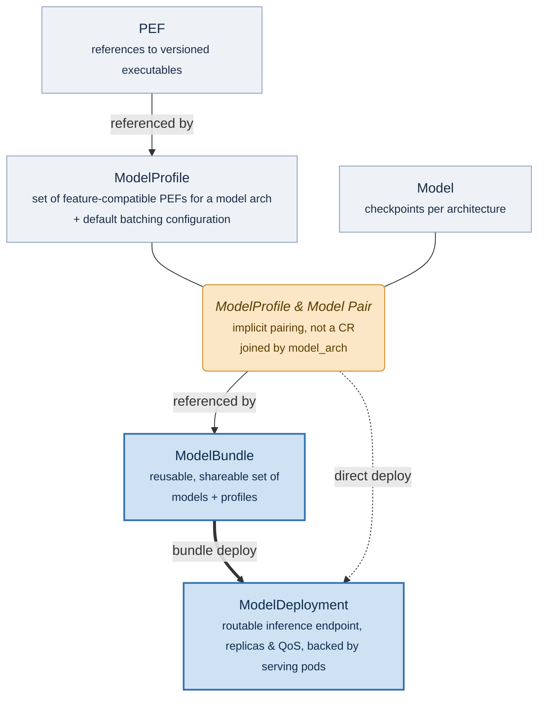
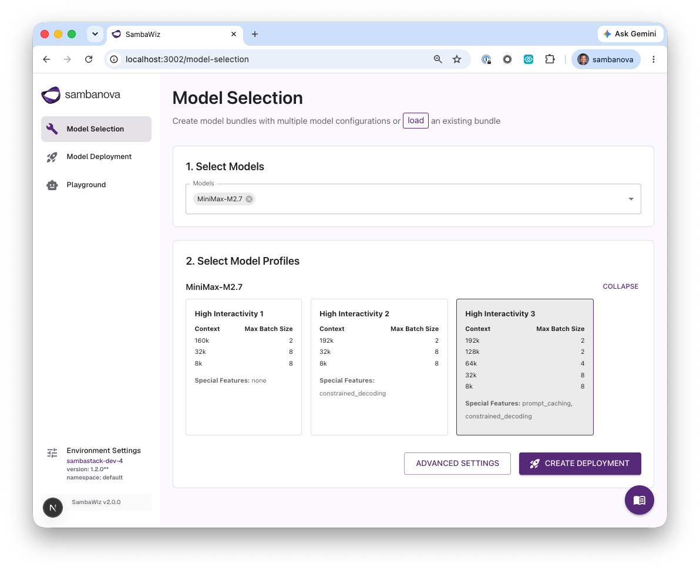
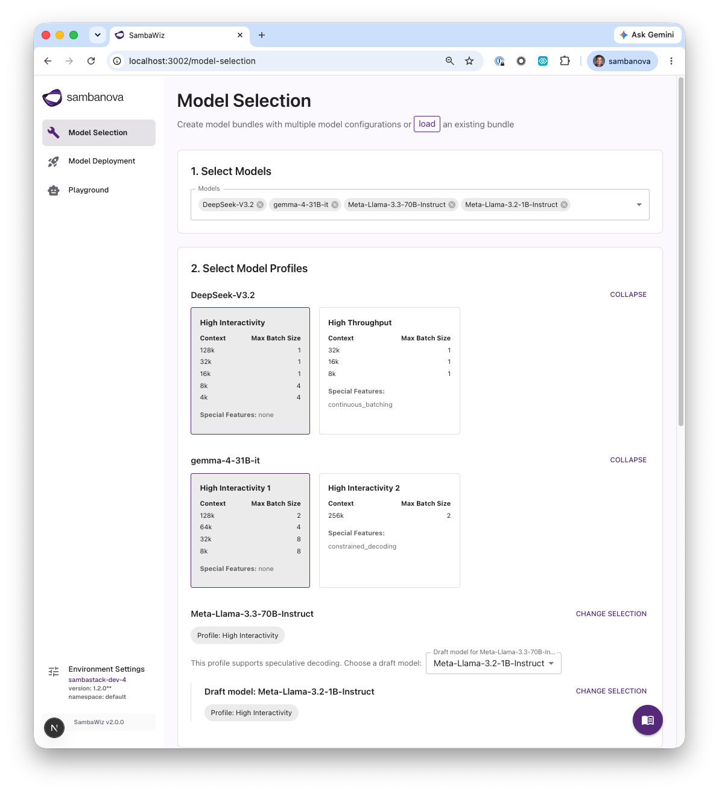
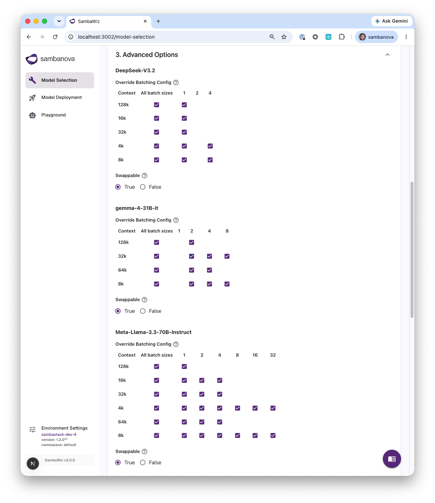
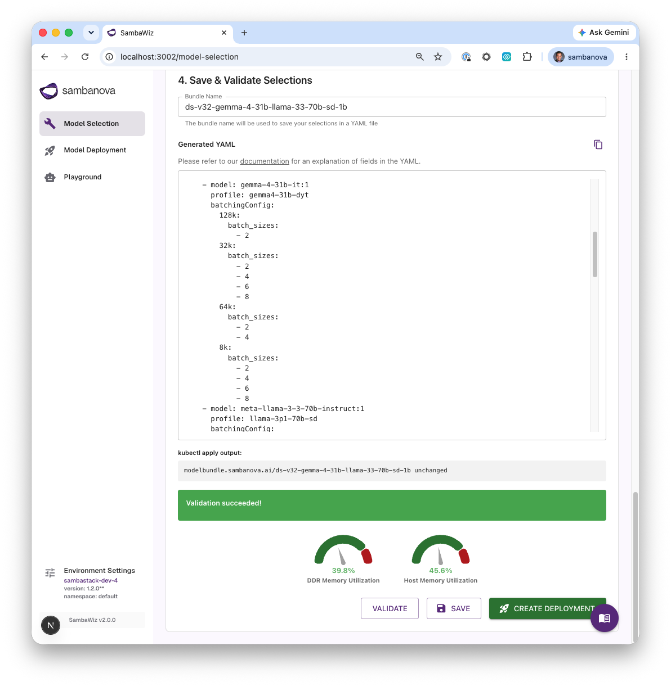
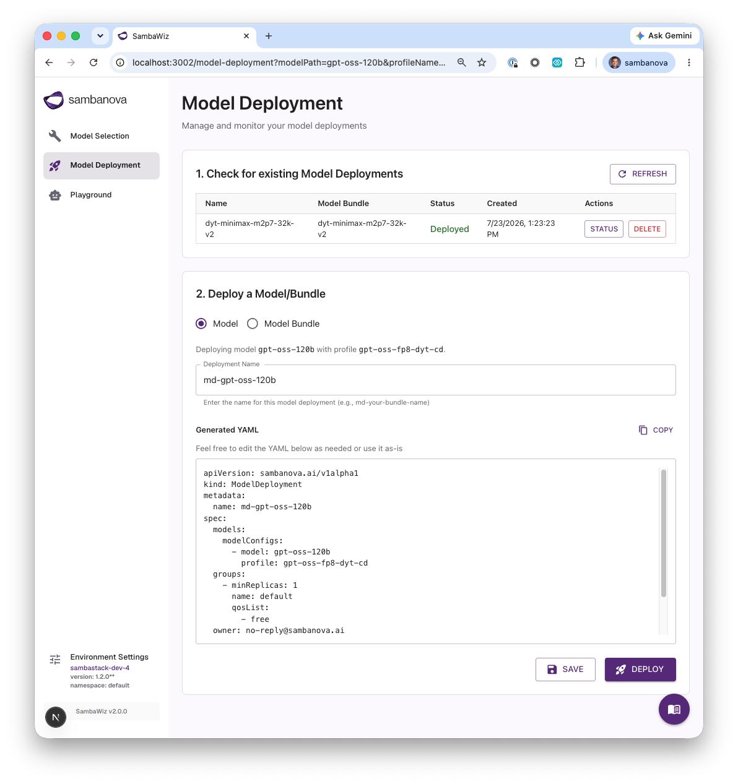
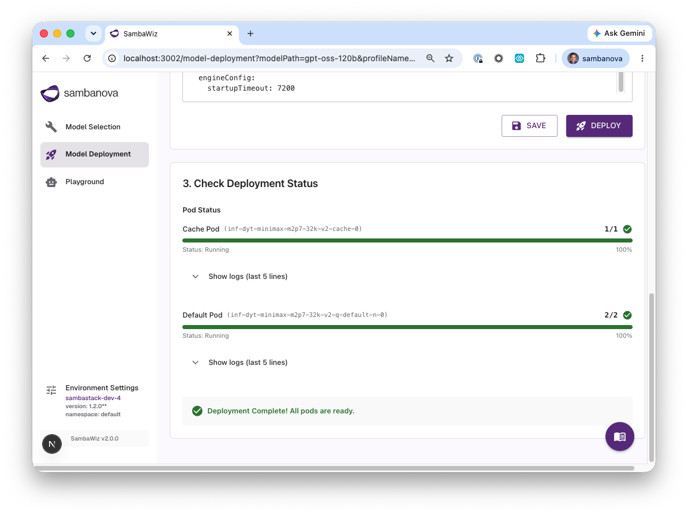
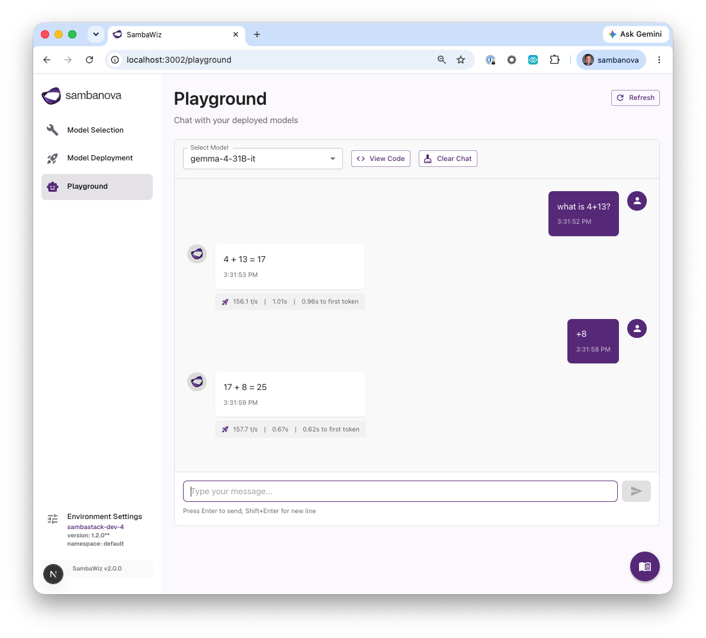

<a href="https://sambanova.ai/">
<picture>
  <source media="(prefers-color-scheme: dark)" srcset="../images/light-logo.png" height="100">
  
</picture>
</a>

# SambaWiz

SambaWiz is a GUI wizard that accelerates deploying and serving models on [SambaStack](https://docs.sambanova.ai/docs/en/sambastack/getting-started/introduction). Pick a model and a profile and deploy it directly, or combine several models into a validated model bundle.

> **SambaWiz 2.0** targets SambaStack's **v3 resource model** (`Model`, `ModelProfile`, `ModelBundle`, and `ModelDeployment` custom resources), in which a model can be deployed on its own — a bundle is no longer required. This is a breaking change from 1.x — the old `BundleTemplate`/`Bundle` resources and the PEF/checkpoint-directory workflow have been replaced. See [Key Concepts](#key-concepts). See the [VERSION](VERSION) file for the minimum SambaStack helm version.

## Contents

- [Overview](#overview)
- [Prerequisites](#prerequisites)
- [Getting Started](#getting-started)
  - [1. Install Dependencies](#1-install-dependencies)
  - [2. Configure Application Settings](#2-configure-application-settings)
  - [3. Configure Kubernetes Access](#3-configure-kubernetes-access)
  - [4. Run the Development Server](#4-run-the-development-server)
  - [5. Build for Production](#5-build-for-production)
- [Key Concepts](#key-concepts)
- [Features](#features)
  - [1. Home](#1-home)
  - [2. Model Selection](#2-model-selection)
  - [3. Model Deployment](#3-model-deployment)
  - [4. Playground](#4-playground)
- [Data Caches](#data-caches)
- [Project Structure](#project-structure)
- [API Endpoints](#api-endpoints)
- [Technology Stack](#technology-stack)
- [Development](#development)
- [Testing](#testing)
- [Security Considerations](#security-considerations)
- [Troubleshooting](#troubleshooting)
- [CLI →](README-CLI.md)

## Overview

**With SambaWiz 2.0, you can deploy a model directly — pick a model and a profile and deploy it, no bundle required.** This is the primary flow. Bundling several models together into a validated `ModelBundle` is still fully supported and remains an important capability when you want to serve multiple models as one unit or apply advanced per-model overrides — but it is no longer a prerequisite for getting a model running.

SambaWiz provides an intuitive interface to:
- Select a model and a `ModelProfile` and deploy it directly to your cluster
- Optionally combine multiple models — with speculative-decoding draft pairing and per-tier batching overrides — into a single `ModelBundle`, validated against the SambaStack legalizer (with DDR/host memory utilization feedback)
- Deploy models or bundles as `ModelDeployment` resources and monitor pod readiness and logs in real time
- Chat with deployed models in an interactive playground, complete with performance metrics and copy-paste code snippets
- Optionally install SambaStack into a cluster directly from the Home page

SambaWiz also ships as a fully interactive terminal CLI — see [README-CLI.md](README-CLI.md).

## Prerequisites

- Access to a Kubernetes cluster with SambaStack [installed](https://docs.sambanova.ai/docs/en/sambastack/getting-started/introduction) and the SambaNova CRDs available (minimum SambaStack Helm version specified in the [VERSION](VERSION) file). SambaWiz can also install SambaStack for you from the Home page.
- A valid kubeconfig for your SambaStack environment
- Node.js 18+ and npm
- `kubectl` and `helm` installed and available on your `PATH` (SambaWiz invokes them via Node.js `child_process`)

## Getting Started

### 1. Install Dependencies

```bash
npm install
```

### 2. Configure Application Settings

SambaWiz stores its configuration in `app-config.json` in the project root. You can either create it by copying the example, or let the app auto-generate it on first launch (it will scan `kubeconfigs/` and pre-populate any kubeconfig files it finds).

```bash
cp app-config.example.json app-config.json
```

Example `app-config.json`:

```json
{
  "currentKubeconfig": "your-environment-name",
  "kubeconfigs": {
    "your-environment-name": {
      "file": "kubeconfigs/your-environment.yaml",
      "namespace": "default",
      "uiDomain": "https://ui-your-environment.example.com/",
      "apiDomain": "https://api-your-environment.example.com/",
      "apiKey": "your-api-key-here"
    }
  }
}
```

**Fields:**
- `currentKubeconfig`: Name of the currently selected environment (must match a key in `kubeconfigs`).
- `kubeconfigs`: Map of environment name → configuration. Each entry has:
  - `file`: Path to the kubeconfig file, relative to the `sambawiz/` folder.
  - `namespace`: Kubernetes namespace for the environment.
  - `uiDomain` *(optional)*: SambaStack UI domain, used to help generate an API key.
  - `apiDomain` *(optional)*: OpenAI-compatible API domain — **required for Playground** chat/embeddings.
  - `apiKey` *(optional)*: API key for inference — **required for Playground**.
- `checkpoint_overrides` *(optional)*: Map of model name → checkpoint version, to pin a specific checkpoint version when a model exposes more than one.

**Notes:**
- `app-config.json` is **gitignored** to keep credentials out of version control. Use `app-config.example.json` (safe to commit) as a template.
- You can configure multiple environments and switch between them from the Home page.
- Configuration can also be edited through the Home page UI.
- Unlike SambaWiz 1.x, there is **no `checkpointsDir` setting** — checkpoints are resolved from each model's `Model` custom resource in the cluster, not from a storage path you configure.

### 3. Configure Kubernetes Access

Place your kubeconfig files in the `kubeconfigs/` directory:

```bash
cp /path/to/your/kubeconfig.yaml ./kubeconfigs/your-environment.yaml
```

Then add (or select) the environment in `app-config.json`, or use the Home page to do it interactively.

**Notes:**
- All files in `kubeconfigs/` are gitignored (except `kubeconfig_example.yaml`).
- The kubeconfig is validated on the Home page using `helm list` to verify cluster connectivity and read the installed SambaStack Helm version.
- If validation fails, an error dialog appears with guidance to check your kubeconfig and network/VPN connection.
- The SambaStack Helm version is displayed in the navigation sidebar when validation succeeds.

### 4. Run the Development Server

```bash
npm run dev
```

Open [http://localhost:3000](http://localhost:3000) in your browser. The Home page loads first, where you select your environment and namespace.

### 5. Build for Production

```bash
npm run build
npm start
```

## Key Concepts

SambaWiz 2.0 works with SambaStack's v3 custom resources (all `apiVersion: sambanova.ai/v1alpha1`). The diagram below shows how they relate — and, crucially, which ones already live in the cluster versus which ones SambaWiz generates for you:


```mermaid
graph TD
    PEF["PEF<br/><small>references to versioned executables</small>"]
    MP["ModelProfile<br/><small>set&nbsp;of&nbsp;feature‑compatible&nbsp;PEFs&nbsp;for&nbsp;a&nbsp;model&nbsp;arch<br/>+&nbsp;default&nbsp;batching&nbsp;configuration</small>"]
    M["Model<br/><small>checkpoints per architecture</small>"]
    MB["ModelBundle<br/><small>reusable,&nbsp;shareable&nbsp;set&nbsp;of<br/>models&nbsp;+&nbsp;profiles</small>"]
    MD["ModelDeployment<br/><small>routable inference endpoint, replicas &amp; QoS, backed by serving pods</small>"]
    JP("<i>ModelProfile & Model Pair</i><br/><small>implicit pairing, not a CR<br/>joined by model_arch</small>")

    PEF -->|"referenced by"| MP
    MP --- JP
    M --- JP
    JP -->|"referenced by"| MB
    MB ==>|"bundle deploy"| MD
    JP -.->|"direct deploy"| MD

    classDef cluster fill:#eef2f7,stroke:#8aa0bd,color:#1a2b45;
    classDef authored fill:#cfe2f3,stroke:#2f6fb0,color:#0d2c4d,stroke-width:2px;
    classDef config fill:#fbe7c6,stroke:#c9871f,color:#5c3d00;
    class PEF,MP,M cluster;
    class MB,MD authored;
    class JP config;
```

<sub>**Light boxes** are CRs that already exist in the cluster (SambaWiz only *references* them); **darker boxes** are the CRs SambaWiz *generates and applies*; the **italic amber box** is an *implicit* pairing of a `Model` and a `ModelProfile` — not a standalone CR, it corresponds to a single entry in `spec.modelConfigs`. The dashed arrow marks the direct-deploy path (no bundle); the thick arrow is the bundle-based deploy path. `referenced by` points from a component to the resource that references it — a `ModelProfile` lists many `PEF`s, and a `ModelBundle` groups many model + profile pairings.</sub>

- **`Model`** — the source of checkpoints. A `Model` CR holds the checkpoint versions for each architecture it supports. Checkpoints are resolved by the operator from the referenced `Model` at reconcile time; they are never authored in the bundle.
- **`ModelProfile`** — defines the runtime shape for a **single** model: which PEFs it uses, its per-tier batching configuration, and its `model_arch` (the join key back to a `Model`'s checkpoint architecture). Profiles are reusable and are expected to already exist in the cluster; SambaWiz does not author them.
- **`ModelBundle`** — combines one or more `Model` + `ModelProfile` pairs into a single deployable unit. Its `spec.modelConfigs` list references each model and profile **by name**, with an optional per-model batching override. Bundling is **optional** in 2.0 — you only need it to serve multiple models as one unit, to pair a draft model for speculative decoding, or to apply advanced overrides. The Model Selection page generates and validates it when you take the bundle route.
- **`ModelDeployment`** — the resource that actually runs a model, creating the serving pods. A **direct model deployment** inlines the chosen model + profile under `spec.models` (no bundle involved); a **bundle deployment** instead references a `ModelBundle` by name via `spec.bundle`.

**PEF (Processor Executable Format)** — pre-compiled model executables listed inside a `ModelProfile`. SambaWiz abstracts individual PEF/sequence-size/batch-size selection behind the profile you pick; the only place a PEF surfaces directly is speculative-decoding detection (a profile is treated as a speculative-decoding profile when a PEF name contains `sd`).

**Speculative decoding** — a smaller "draft" model proposes tokens that a larger "target" model verifies, improving inference speed. When you pick a speculative-decoding profile, SambaWiz prompts for a draft model and adds it to the bundle as its own (non-routable) model entry.

## Features

### 1. Home
- **Environment Configuration**: Select a Kubernetes environment, set the namespace, and configure the API domain/key used for the Playground.
- **Prerequisites & Connectivity Check**: Verifies `kubectl`/`helm` are installed and validates the kubeconfig against the cluster on load.
- **SambaStack Installer**: Generate and apply an installation manifest to bring SambaStack up in a cluster, with live installer log streaming.
- **Cache Refresh**: Clicking **Apply** refreshes the local model and profile caches from the cluster (see [Data Caches](#data-caches)).
- **Version Display**: Shows the SambaStack Helm version in the navigation sidebar when connected.

### 2. Model Selection

The Model Selection page (formerly "Bundle Builder") is where you choose the model(s) you want to serve. **For a single model, pick a profile and click _Deploy Model_ to go straight to deployment — no bundle is created.** Selecting multiple models, using speculative decoding, or opening _Advanced Settings_ switches to the **bundle route**, where your selections are combined into a `ModelBundle` and validated before deployment.

- **Model Selection**: Choose one or more models from those available in your cluster. Models with no matching profile are excluded and called out in a warning banner.
- **Architecture Selection**: For multi-architecture models, an architecture dropdown must be resolved before profiles are listed (single-architecture models skip this).
- **Profile Selection**: Pick exactly one `ModelProfile` per model from a row of card tiles. A single matching profile is auto-selected.
- **Deploy Model (direct path)**: With a single model and a profile chosen, deploy it directly — the model and profile are inlined into the `ModelDeployment`, so **no `ModelBundle` is created**.


*Pick a model and profile, then deploy it directly — or open Advanced Settings to build a bundle*

The remaining steps apply to the **bundle route** — used for multiple models, speculative decoding, or when you open Advanced Settings:

- **Speculative Decoding**: Choosing a speculative-decoding profile surfaces a draft-model dropdown; the draft is added to the bundle and recorded in `spec.specDecodingPairs`.
- **YAML Generation**: A single `ModelBundle` YAML document is generated automatically as selections change.
- **Load Existing Bundle**: Start from an existing bundle instead of a blank slate.


*Bundle multiple models together, including a speculative-decoding draft model*

- **Advanced Options**: Override each model's per-tier batching configuration (explicit batch sizes or "all batch sizes"), and toggle whether the model is swappable.


*Override batching configuration per sequence-length tier and set swappable behavior*

- **Validation**: Apply the bundle to the cluster and read back the legalizer result — pass/fail, errors/warnings, and DDR/host memory utilization gauges.
- **Save**: Save the generated YAML to the `saved_artifacts/` directory.
- **Create Deployment**: Jump straight to the Model Deployment page after a successful validation.


*Validate against the legalizer, view memory utilization, then save or create a deployment*

### 3. Model Deployment

The Model Deployment page (formerly "Bundle Deployment") manages the deployment lifecycle.

- **Existing Deployments**: Lists all `ModelDeployment` resources in the namespace with status (Deployed / Deploying / Not Deployed), and lets you delete them or jump to status monitoring.
- **Deploy a Model or Bundle**: Deploy a single model (profile inlined directly — arriving here from Model Selection's _Deploy Model_ pre-fills it) or a full `ModelBundle`, with the `ModelDeployment` YAML generated automatically and editable before applying.


*Review existing deployments and generate a ModelDeployment manifest to deploy*

- **Status Monitoring**: Real-time monitoring of the cache pod and default pod, with readiness progress bars, live log tails, and auto-refresh. SambaWiz resolves the real (possibly hash-truncated) pod names from the cluster so monitoring works even for long deployment names.


*Monitor pod readiness and stream logs until the deployment is complete*

### 4. Playground
- **Interactive Chat**: Test deployed models through a chat interface.
- **Routable Models Only**: The model list comes from the environment's OpenAI-compatible `/v1/models` endpoint, so only models that can actually be served are shown.
- **Chat & Embeddings**: Chat models use `/v1/chat/completions`; embedding models (detected via the model's `capabilities`) use `/v1/embeddings`.
- **Performance Metrics**: Real-time tokens/second, total latency, and time-to-first-token.
- **View Code**: Copy-ready cURL and Python snippets for the selected model.


*Interactive chat interface with performance metrics and code examples*

## Data Caches

Model Selection and the Playground do not call `kubectl` to list models/profiles on every render. Instead they read from local JSON caches under `app/data/`, refreshed when you click **Apply** on the Home page:

- `checkpoint_mapping.json` — from `kubectl get models -o json`: each model's display/resource name, checkpoint architectures and versions, and `capabilities`.
- `model_profiles.json` — from `kubectl get modelprofiles -o json`: each profile's `model_arch`, `features`, batching config, and `pefs`.
- `pef_configs.json` — PEF sequence-size/batch-size configurations.

Model Selection joins these caches on `model_arch` to decide which profiles are offered for which model. **These files are gitignored and regenerated by the app** — if you add or change models/profiles in the cluster, return to Home and click Apply to refresh them.

## Project Structure

```
sambawiz/
├── app/
│   ├── api/                          # Next.js API routes (kubectl/helm, config, inference)
│   ├── components/
│   │   ├── AppLayout.tsx             # Navigation layout + version display
│   │   ├── Home.tsx                  # Home / environment selector / installer
│   │   ├── ModelSelection.tsx        # Model Selection page
│   │   ├── ModelDeploymentManager.tsx# Model Deployment page
│   │   ├── Playground.tsx            # Playground page
│   │   └── DocumentationPanel.tsx    # In-app docs drawer
│   ├── data/                         # Auto-generated caches (gitignored)
│   ├── model-selection/page.tsx      # /model-selection route
│   ├── model-deployment/page.tsx     # /model-deployment route
│   ├── playground/page.tsx           # /playground route
│   ├── types/bundle.ts               # v3 resource TypeScript interfaces
│   ├── utils/                        # YAML generation, model availability, pod-name logic
│   └── page.tsx                      # Home page (/)
├── bin/cli.ts                        # Interactive terminal CLI
├── docs/                             # Feature documentation (source)
├── public/docs/                      # Feature documentation served in-app
├── kubeconfigs/                      # Kubeconfig files (gitignored except example)
├── saved_artifacts/                  # Saved bundle/deployment YAML (gitignored)
├── temp/                             # Temporary YAML files (gitignored)
├── app-config.json                   # Local configuration (gitignored)
├── app-config.example.json           # Configuration template
└── VERSION                           # App + minimum SambaStack Helm versions
```

## API Endpoints

SambaWiz's UI is backed by Next.js API routes that shell out to `kubectl`/`helm` and proxy inference calls. Key routes include:

| Route | Purpose |
| --- | --- |
| `GET /api/environments` | List configured environments and current settings |
| `POST /api/update-config` | Update the selected environment and namespace |
| `GET /api/check-prerequisites` | Verify `kubectl`/`helm` are installed |
| `GET /api/kubeconfig-validate` | Validate the kubeconfig and read the SambaStack Helm version |
| `POST /api/install-sambastack` | Generate and apply a SambaStack install manifest |
| `POST /api/generate-checkpoint-mapping` | Refresh `checkpoint_mapping.json` from `kubectl get models` |
| `POST /api/generate-model-profiles` | Refresh `model_profiles.json` from `kubectl get modelprofiles` |
| `POST /api/validate` | Apply a `ModelBundle` and return its legalizer status |
| `GET /api/model-bundles` | List validated `ModelBundle` resources |
| `POST /api/deploy-bundle` | Apply a `ModelDeployment` |
| `GET /api/deployed-bundles` | List `ModelDeployment` resources and their status |
| `GET /api/pod-status`, `GET /api/pod-logs` | Monitor deployment pods and stream logs |
| `GET /api/models` | List routable models (`/v1/models`) for the Playground |
| `POST /api/chat`, `POST /api/embeddings` | Proxy chat/embedding requests to the environment API |
| `POST /api/save-artifact`, `GET /api/saved-artifacts` | Save/list generated YAML artifacts |

The full set of routes lives under [app/api/](app/api/).

## Technology Stack

- **Framework**: Next.js 16 (App Router)
- **UI Library**: Material-UI (MUI) v7
- **Language**: TypeScript
- **Styling**: Emotion (CSS-in-JS)
- **Backend**: Next.js API routes with Node.js `child_process` for `kubectl`/`helm`
- **Kubernetes**: `@kubernetes/client-node`, `js-yaml`
- **Visualization**: `react-gauge-chart` (memory utilization), `react-syntax-highlighter`, `react-markdown`
- **CLI**: `@inquirer/prompts` (see [README-CLI.md](README-CLI.md))

## Development

```bash
npm run dev         # Development server with hot reload
npm run type-check  # TypeScript checking
npm run lint        # Linting
npm run build       # Production build
npm run dev-cli     # Run the interactive CLI
```

## Testing

SambaWiz includes a Jest test suite covering business logic, YAML generation, and API integration.

```bash
npm test                              # Run all tests
npm run test:watch                    # Watch mode
npm run test:coverage                 # Coverage report
npm test bundle-yaml-generator.test.ts # A specific test file
```

Detailed test documentation — philosophy, categories, coverage, and manual integration procedures — is in [app/utils/__tests__/TESTS.md](app/utils/__tests__/TESTS.md).

The suite focuses on:
- ✅ Model/profile availability and filtering logic
- ✅ `ModelBundle` and `ModelDeployment` YAML generation and parsing
- ✅ Deployment status and pod-name resolution
- ✅ API integration for the page components and generators
- ✅ CLI behavior

It intentionally does **not** cover UI rendering details, third-party libraries, or browser features.

## Security Considerations

- `app-config.json`, everything in `kubeconfigs/` (except the example), `saved_artifacts/`, `temp/`, and the auto-generated caches in `app/data/` are all gitignored to prevent leaking credentials or environment details.
- Use `app-config.example.json` (dummy values) as a template — it is safe to commit.
- API routes run `kubectl`/`helm` server-side with timeouts.
- Never commit sensitive configuration files, kubeconfigs, or API keys.
- Consider adding authentication/authorization before exposing SambaWiz beyond local use.

## Troubleshooting

### Configuration Issues

**Application fails to start or shows configuration errors**
- Ensure `app-config.json` exists in the `sambawiz/` root (copy `app-config.example.json`, or let the app auto-create it).
- Ensure `currentKubeconfig` matches a key in `kubeconfigs`, and that each entry has a valid `file` path and `namespace`.
- For the Playground, ensure `apiDomain` and `apiKey` are set for the current environment.
- Verify the referenced kubeconfig file actually exists at the given path.

### No Models or Profiles Appear on Model Selection

- The model/profile lists come from local caches. Go to **Home** and click **Apply** to refresh them from the cluster.
- If a model is listed in the warning banner as excluded, it has no `ModelProfile` matching any of its checkpoint architectures in the cluster.

### Version Compatibility Issues

- Verify your SambaStack Helm version meets the minimum in the [VERSION](VERSION) file:
  ```bash
  helm list --kubeconfig ./kubeconfigs/your-environment.yaml -n <namespace>
  ```
- Verify Node.js is 18+:
  ```bash
  node --version && npm --version
  ```

### Connection Issues

- Confirm you are on the correct network/VPN for your cluster.
- Confirm `kubectl` and `helm` are on your `PATH`:
  ```bash
  kubectl version --client && helm version
  ```
- Test connectivity:
  ```bash
  kubectl get nodes --kubeconfig ./kubeconfigs/your-environment.yaml
  ```

### Common Error Messages

- **"Your kubeconfig.yaml seems to be invalid"** — the kubeconfig file is missing, malformed, or lacks valid cluster credentials.
- **Version mismatch** — your SambaStack Helm version is below the minimum in the [VERSION](VERSION) file.
- **"Cannot find module" / "ENOENT"** — the kubeconfig `file` path in `app-config.json` is wrong or the file doesn't exist.
- **"Connection refused" / "timeout"** — check your network/VPN and cluster accessibility.

---

## CLI

> **Prefer the terminal?** SambaWiz also ships as a fully interactive CLI — no browser needed.
>
> → **[README-CLI.md](README-CLI.md)** — complete CLI documentation including quick start, all menus, configuration reference, and troubleshooting.

<!-- CLI docs live in README-CLI.md — do not append CLI content here -->
